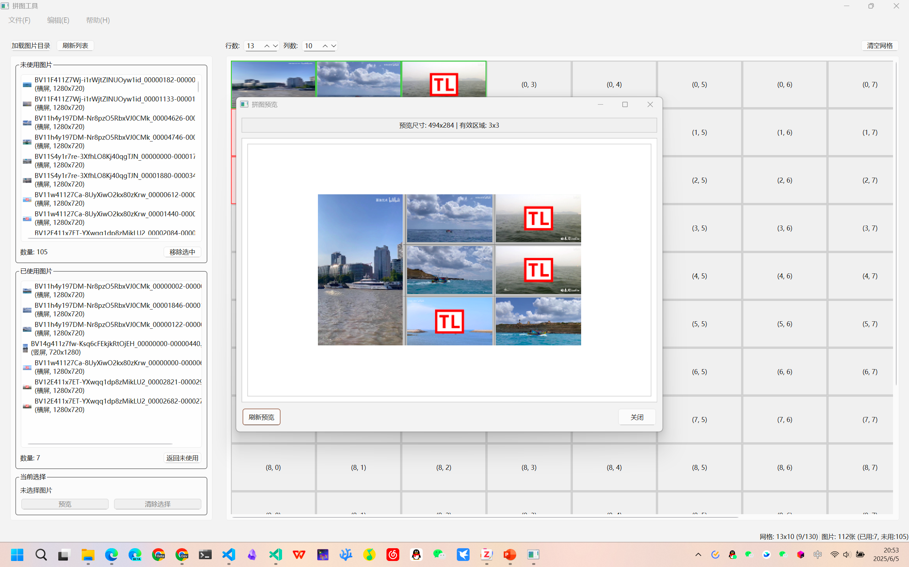
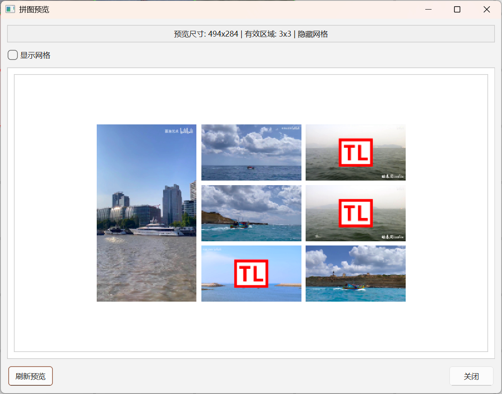
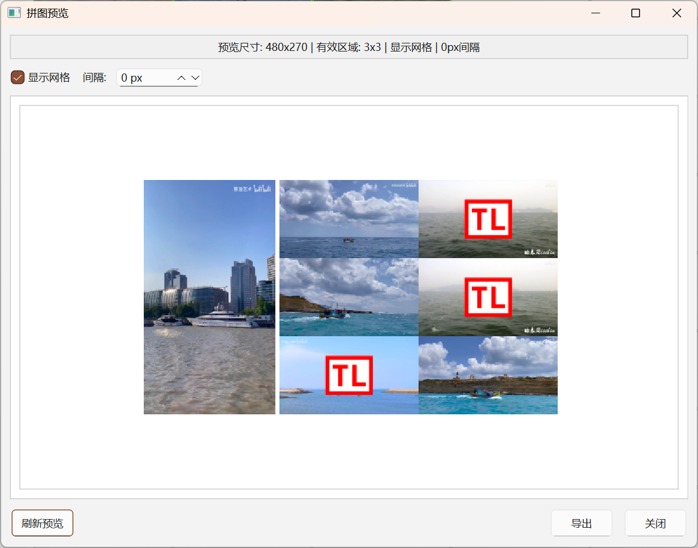
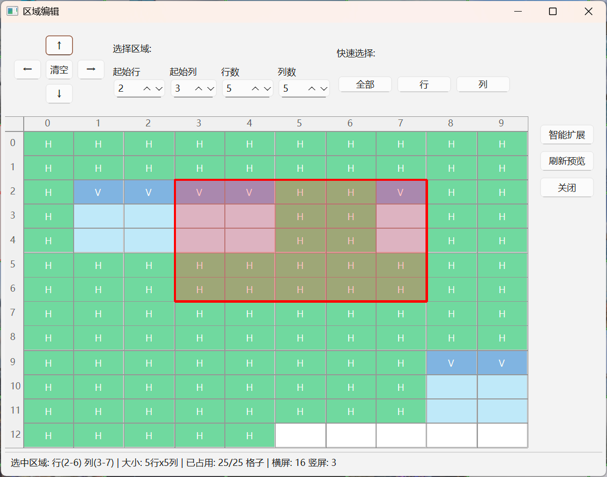
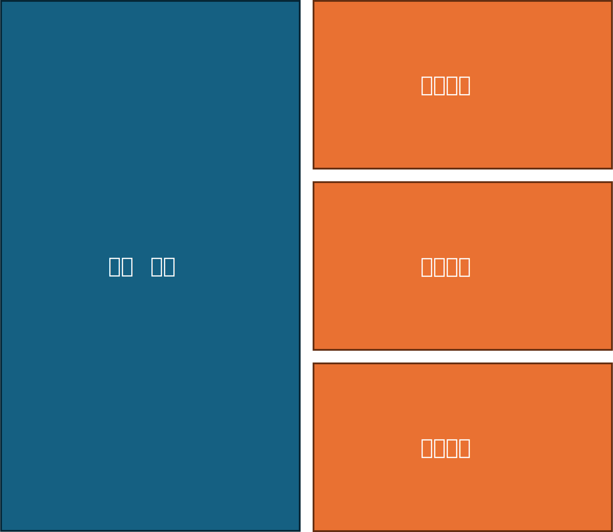

# PicPuzzle - 拼图工具

一个基于PySide6的图片拼图排列工具，支持横屏和竖屏图片的点击选择与放置。

ps. 此处有一个PPT画图，对齐到崩溃的小孔 T_T

## 功能特点

* 🖼️ 支持多种图片格式（JPG, PNG, BMP, TIFF, WebP）
* 📱 自动识别横屏和竖屏图片（基于16:9比例）
* 📐 竖屏图片占用3个网格单元的高度
* 🎯 网格化布局，精确排列，**支持自定义网格数量**
* 🧹 支持清空和重置功能
* 🔄 支持保存与状态恢复
* 🖱️ 支持图片点击选择与格子点击放置
* 🗂️ 已用/未用图片列表，便于管理
* 🖼️ 网格预览尺寸为640x310，**最终导出为1920x1080**
* 🖼️ 支持滚动条（QScrollArea），适应大尺寸拼图
* 📏 自动计算竖屏与横屏间隔，保证视觉一致性
* 👁️ 实时预览功能，所见即所得的导出预览
* 🎛️ 区域编辑功能，支持批量选择、移动和清空操作
* 📐 九宫格方向控制，精确的区域移动操作
* 🎯 智能扩展功能，自动处理竖屏图片的完整性

### 点选放入图片/点击清除图片



### 导出前预览



### 支持自定义间隔



### 支持区域操作

练练手，自制Excel(bushi)~



## TODO

* [x] 间距调整
* [x] 区域操作(清空、移动)
* [ ] Python PyPI打包
* [ ] 字符串全球化
* [ ] 添加图标
* [ ] 构建二进制文件

## 文件结构

```shell
PicPuzzle/
├── main.py                     # 程序入口
├── config.py                   # 配置文件
├── models.py                   # 数据模型类
├── main_window.py              # 主窗口类
├── grid_widget.py              # 网格组件
├── image_list_widget.py        # 图片列表组件
├── grid_preview_widget.py      # 网格预览组件
├── direction_grid_widget.py    # 九宫格方向控制组件
├── puzzle_exporter.py          # 拼图导出器
├── preview_window.py           # 预览窗口
├── region_editor_window.py     # 区域编辑窗口
├── state_manager.py            # 状态管理器
├── requirements.txt            # 依赖文件
├── LICENSE                     # 许可证文件
├── README.md                   # 说明文档
├── data/                       # 数据目录
│   └── *.json                  # 保存的状态文件
└── Doc/                        # 文档资源
    ├── *.png                   # 截图
    ├── *.svg                   # 示意图
    └── *.pptx                  # 演示文档
```

## 安装和运行

```bash
pip install -r requirements.txt
```

或手动安装：

```bash
pip install "PySide6>=6.5.0" "Pillow>=10.0.0"
```

### 运行程序

```bash
python main.py
```

## 使用方法

### 基本操作

1. **启动程序**: 运行 `python main.py`
2. **选择文件夹**: 点击"加载图片目录"按钮，选择包含图片的文件夹
3. **点击选择与放置**: 在左侧图片列表点击选择图片，再点击右侧网格目标格子进行放置
4. **调整位置**: 点击已放置的图片可以将其移回图片列表
5. **管理布局**: 使用"清空网格"或"清空图片列表"按钮管理布局
6. **滚动查看**: 当网格较大时，可通过滚动条浏览全部区域

### 预览与导出功能

使用 `Ctrl+P` 或菜单"文件 → 预览与导出拼图"打开预览窗口：

1. **实时预览**: 
   - 自动显示当前拼图布局的预览图
   - 支持滚动查看大尺寸拼图
   - 显示预览尺寸和有效区域信息

2. **显示控制**:
   - **显示网格**: 切换网格线的显示/隐藏
   - **间隔设置**: 可选择自动计算间隔或手动设置像素值
   - **刷新预览**: 手动刷新预览图像

3. **导出设置**:
   - 点击"导出"按钮打开导出对话框
   - **输出尺寸**: 设置单个格子的输出分辨率（默认1920×1080）
   - **间隔控制**: 可选择自动计算或自定义间隔像素
   - **格式支持**: 支持PNG、JPEG等格式导出

### 区域编辑功能

使用 `Ctrl+E` 或菜单"编辑 → 区域编辑"打开区域编辑窗口：

1. **区域选择**:
   - **手动设置**: 通过起始行/列和行数/列数精确定义区域
   - **快速选择**: 一键选择全部网格、单行或单列
   - **拖拽选择**: 在预览区域直接拖拽鼠标选择区域
   - **点击选择**: 单击预览区域的格子快速选择

2. **区域操作**:
   - **九宫格移动**: 使用方向按钮(↑↓←→)移动选中区域的图片
   - **清空区域**: 点击中心"清空"按钮清空选中区域的所有图片
   - **智能扩展**: 自动扩展选择区域以包含完整的竖屏图片

3. **可视化预览**:
   - **颜色区分**: 横屏图片显示为绿色，竖屏图片显示为蓝色
   - **选中高亮**: 当前选中的区域用红色边框高亮显示
   - **实时更新**: 操作后立即更新预览显示

4. **实用技巧**:
   - 竖屏图片占用3个格子高度，移动时会自动处理跨格子的情况
   - 区域移动会检查目标位置是否有足够空间
   - 支持批量移动多个图片，提高排列效率

### 状态管理

- **保存状态**: `Ctrl+S` 保存当前布局到JSON文件
- **加载状态**: `Ctrl+O` 从文件恢复之前保存的布局
- **自动提示**: 退出时如有未保存修改会自动提示

## 图片与网格规则

* **横屏图片**: 占用1×1网格单元
* **竖屏图片**: 占用3×1网格单元（3行1列）
* **支持格式**: .jpg, .jpeg, .png, .bmp, .tiff, .webp
* **比例识别**: 基于16:9比例自动识别横屏/竖屏
* **网格数量可调**: 支持通过参数设置行列数
* **每个网格预览尺寸**: 640x310
* **最终导出尺寸**: 每格1920x1080
* **间隔算法**:  
  + 横屏视频：16:9比例，宽度W，高度H = W×9/16
  + 竖屏视频：16:9比例，宽度W（相同），高度V = W×16/9  
  + 竖屏与横屏高度比例：V/H = (16/9)/(9/16) = 256/81 ≈ 3.16
  + 竖屏占用3个格子高度加2个间隔：V = 3H + 2×间隔
  + 间隔 = (V - 3H) / 2 = (256H/81 - 3H) / 2 = H×13/162
  + 这样确保竖屏和横屏图片保持正确的16:9比例关系



## 界面说明

### 左侧面板

* **控制面板**: 文件夹选择、清空、重置功能
* **图片列表**: 显示未放置的图片，支持滚动
* **已用图片列表**: 显示已放入网格的图片

### 右侧面板

* **网格控制**: 可调整行数和列数，默认13×10
* **网格区域**: 点击放置区域，先选图片再点格子放置
* **滚动条**: 网格超出窗口时自动出现

### 预览窗口界面

* **控制选项**: 显示网格开关、间隔设置
* **预览区域**: 实时显示拼图效果，支持滚动查看
* **信息显示**: 预览尺寸、有效区域、网格状态等信息
* **导出按钮**: 一键打开导出设置对话框

### 区域编辑窗口界面

* **九宫格控制**: 方向移动按钮(↑↓←→)和中心清空按钮
* **区域设置**: 起始行列、区域大小的数值输入
* **快速选择**: 全部、单行、单列的一键选择按钮
* **预览区域**: 带颜色标识的网格预览，支持拖拽和点击选择
* **智能扩展**: 自动调整选择区域以包含完整竖屏图片

## 快捷键

* `Ctrl+L`: 加载图片目录
* `Ctrl+S`: 保存状态
* `Ctrl+O`: 加载状态
* `Ctrl+P`: 预览与导出拼图
* `Ctrl+R`: 清空网格
* `Ctrl+E`: 区域编辑
* `Ctrl+Q`: 退出程序

## 技术架构

### 设计模式

* **MVC架构**: 模型、视图、控制器分离
* **组件化设计**: 功能模块解耦
* **信号槽机制**: 事件驱动通信

### 核心组件

* **PuzzleModel**: 拼图数据模型，管理网格和图片状态
* **ImageInfo**: 图片信息数据类
* **GridCell**: 网格单元格数据类
* **MainWindow**: 主界面控制器
* **GridWidget**: 网格布局管理器
* **ImageListWidget**: 图片列表管理器
* **GridPreviewWidget**: 网格预览组件
* **PuzzleExporter**: 拼图导出器
* **StateManager**: 状态管理器

## 开发说明

### 扩展功能

如需扩展功能，可以考虑以下方面：

1. **保存/加载布局**: 将排列结果保存为配置文件 ✅ 已实现
2. **导出功能**: 将排列结果导出为图片（每格1920x1080）✅ 已实现
3. **区域编辑**: 支持区域选择、移动和批量操作 ✅ 已实现
4. **预览功能**: 实时预览和导出设置 ✅ 已实现
5. **自动排列**: 实现智能自动排列算法
6. **缩放功能**: 支持网格大小调整
7. **多窗口**: 支持多个排列项目

### 代码结构

* `config.py`: 配置文件，包含网格参数、间隔计算等配置
* `models.py`: 定义数据结构，易于扩展新的属性
* `main_window.py`: 主窗口类，协调各组件，处理用户交互
* `grid_widget.py`: 网格组件，处理网格显示和交互
* `image_list_widget.py`: 图片列表组件，管理图片显示和选择
* `grid_preview_widget.py`: 网格预览组件，显示网格缩略图和选中区域
* `direction_grid_widget.py`: 九宫格方向控制组件，用于区域操作
* `puzzle_exporter.py`: 处理拼图导出逻辑
* `preview_window.py`: 预览窗口，导出前预览功能
* `region_editor_window.py`: 区域编辑窗口，支持区域选择和操作
* `state_manager.py`: 状态管理器，处理保存和加载功能

## 故障排除

### 常见问题

1. **程序无法启动**
   * 检查Python版本（推荐3.8+）
   * 确认PySide6安装正确

2. **图片无法显示**
   * 检查图片文件是否损坏
   * 确认文件格式是否支持

3. **导出失败**
   * 确保有足够的磁盘空间
   * 检查导出路径的写入权限

## 许可证

本项目仅供学习和研究使用。

## 贡献

欢迎提交问题和改进建议！
